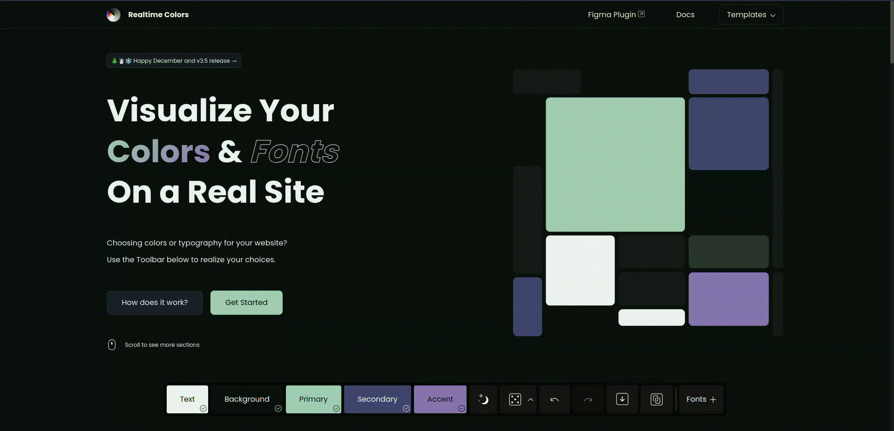
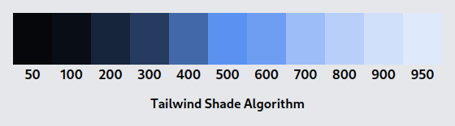
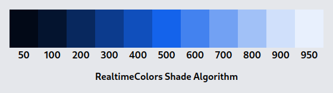

Recently, I came across a site called [RealtimeColors.com](https://www.realtimecolors.com/), It's a pretty cool site that helps you choose colors for your site and visualize them on a real site.



The site provides an export for tailwind, but it's tedious to copy and set up everything and change the colors later. So, _as a developer myself_, I spent 2 days automating a task that would **hardly** take 2 minutes of my life. The result is [`tailwind-plugin-realtime-colors`](https://www.npmjs.com/package/tailwind-plugin-realtime-colors). Please consider [giving a star](https://github.com/BlankParticle/tailwind-plugin-realtime-colors) to the repo.

Sit tight, as this is gonna be a long ride.

## Creating Tailwind Plugins

TailwindCSS provides a [Plugin API](https://tailwindcss.com/docs/plugins). It is not that intuitive, to be honest. Here is a snippet they provide on their site.

```typescript
const plugin = require("tailwindcss/plugin");

module.exports = {
  plugins: [
    plugin(function ({ addUtilities, addComponents, e, config }) {
      // Add your custom styles here
    }),
  ],
};
```

At a glance you can't understand what the _f\*ck_ is going on, but here is what It actually means in ES6 syntax.

```typescript
// tailwind.config.ts
import plugin from "tailwindcss/plugin";

const somePlugin = plugin(({ addUtilites }) => {
  addUtilites(/*...*/);
  //...
});

export default {
  // ...
  plugins: [somePlugin()],
  // ...
};
```

### Actually creating the plugin

So, I started working on the plugin in a file called `realtime-colors.ts` in the project directory. I wanted to achieve this kind of configuration.

```typescript
import realtimeColors from "./realtime-colors.ts";

export default {
  //...
  plugins: [
    realtimeColors("https://www.realtimecolors.com/?colors=e8eef4-050709-a1b9d1-75393b-ab9d54" /*Some config options*/),
  ],
  //...
};
```

I wrote some type definitions and function signatures for the starter.

```typescript
// realtime-colors.ts
import plugin from "tailwindcss/plugin";

type HexColor = `#${string}`;
type Plugin = ReturnType<typeof plugin>;
export type RealtimeColorOptions = {
  colors: {
    text: HexColor;
    background: HexColor;
    primary: HexColor;
    secondary: HexColor;
    accent: HexColor;
  };
  // don't worry about these options now
  theme: boolean;
  shades: (keyof RealtimeColorOptions["colors"])[];
  prefix: string;
  shadeAlgorithm: keyof typeof availableModifiers;
};
type RealtimeColorOptionsWithoutColor = Omit<RealtimeColorOptions, "colors">;

// ...

function realtimeColors(
  config: Pick<RealtimeColorOptions, "colors"> & Partial<RealtimeColorOptionsWithoutColor>,
): Plugin;
function realtimeColors(url: string, extraConfig?: Partial<RealtimeColorOptionsWithoutColor>): Plugin;
function realtimeColors(
  configOrUrl: string | Pick<RealtimeColorOptions, "colors">,
  extraConfig?: Partial<RealtimeColorOptionsWithoutColor>,
): Plugin {
  // Handle the passed options and return plugin with appropiate config
}

export default realtimeColors;
```

If you are confused about why there are 3 functions named `realtimeColors` I recommend you learn [function overloading](https://www.typescriptlang.org/docs/handbook/2/functions.html).

Now I check if the first option is a `string`, then I parse the URL, extract the colors and combine it with the optional passed config and `defaultConfig`. If the first option is an object then I just combine it with `defaultConfig`. You can look at the [actual implementation](https://github.com/BlankParticle/tailwind-plugin-realtime-colors/blob/f585af8e85ffbcc64f22c3cbd3b7d678043398df/src/plugin.ts#L161) on my GitHub.

Now for the actual plugin, I have an arrow function called `realtimeColorsPlugin`.

```typescript
const realtimeColorsPlugin = plugin.withOptions<RealtimeColorOptions>(
  (options) =>
    ({ addBase }) =>
      addBase(getCSS(options)),
  (options) => ({
    theme: {
      extend: {
        colors: getTheme(options),
      },
    },
  }),
);
```

> If you want to pass options to the plugin you need to use `plugin.withOptions`

### `getCSS` and `getTheme` function

Before we jump into `getCSS` and `getTheme` function, we need to establish some concepts.

#### Modifiers

A modifier is an object with keys `50|100|200|300|400|500|600|700|800|900|950`, and have function with signature `([number,number,number]) => [number, number, number]`.  
If you haven't guessed already, they take `RGB` colors and modifies the color.  
As of version `1.1.1` of the plugin It has [2 types of modifiers](https://github.com/BlankParticle/tailwind-plugin-realtime-colors/blob/f585af8e85ffbcc64f22c3cbd3b7d678043398df/src/plugin.ts#L25), one is `realtimeColors` which uses the same algorithm as RealtimeColors.com to create the shades of the given colors. Personally, I don't like the shades created by this algorithm. So there is an alternative modifier called `tailwind` which is the default for this plugin.





You can use whatever algorithm you like, but remember the color you selected is not present in `realtimeColors` shades, but it is present in `tailwind` shades as `500`.

Also, by default `primary`, `secondary` and `accent` are shaded. If you also want to shade `text` or `background`, you can do so by passing the colors you want to shade in `shades` array.  
See More about the options [here](https://github.com/BlankParticle/tailwind-plugin-realtime-colors#-options).

#### Theme

The `theme` option decides if the colors should automatically adapt to dark/light mode. there is no need to use `dark:` as the colors are assigned to CSS variables which change based on `dark` class on `html` element.

To create the alternate variant of a certain color, [`invertColor`](https://github.com/BlankParticle/tailwind-plugin-realtime-colors/blob/f585af8e85ffbcc64f22c3cbd3b7d678043398df/src/utils.ts#L5) function is used. I didn't create this function, it was reverse-engineered from RealtimeColors.com.

#### `getCSS` function

This function is responsible for generating the CSS variables. So it returns nothing if `theme` is set to `false` as the colors are directly embedded in the config.  
Otherwise, it generates the values to use in a CSS `rgb/hsl/lch/lab` color function based on the config. It also creates the shades with the specified modifiers if needed. Then the variables are injected into `:root` and `:is(.dark):root`.

The variables are just values without the color function.

```css
:root {
  --text: 3, 32, 30;
  --background: 246, 254, 253;
  --primary-50: 0, 5, 4;
  --primary-100: 1, 14, 13;
  --primary-200: 2, 29, 25;
  --primary-300: 4, 47, 41;
  /*...*/
}
:is(.dark):root {
  /*...*/
}
```

<div data-node-type="callout">
<div data-node-type="callout-emoji">🚧</div>
<div data-node-type="callout-text">At first, I wrote my own functions for color conversion, It was a mess and they were terribly inaccurate. I suggest using an established library like <a target="_blank" rel="noopener noreferrer nofollow" href="https://www.npmjs.com/package/color-convert" style="pointer-events: none"><code>color-convert</code></a> to handle these tasks.</div>
</div>

#### `getTheme` function

It is responsible for adding the colors in the tailwind config. If `theme` is set to `false` then it embeds the color directly in the config. Otherwise, it uses the variables from `getCSS` with the proper color function.

<div data-node-type="callout">
<div data-node-type="callout-emoji">💡</div>
<div data-node-type="callout-text">For some reason <code>rgb</code> doesn't support alpha values with CSS Variables. This problem doesn't happen with <code>hsl</code>,<code>lch</code> or <code>lab</code>. The fix is to use <code>rgba</code> instead of <code>rgb</code>. For other formats than <code>rgba</code>, we can also use <code>&lt;alpha-value&gt;</code> like <code>hsl(var(--text) / &lt;alpha-value&gt;)</code>, even tho it works without it, but it's still recommended.</div>
</div>

And just like that you have your very own TailwindCSS Plugin. Obviously, I skipped a lot of details and implementations. You can visit my [GitHub Repo](https://github.com/BlankParticle/tailwind-plugin-realtime-colors) for the full code.

> While you are going to visit the repo, consider giving it a ⭐, It motivates me.

There is going to be a sequel to this blog on how to convert this file into an npm package, bundle it and deploy it to [npmjs.com](https://www.npmjs.com/) using GitHub Actions. Stay tuned for that.

**it's Blank Particle, Signing Out** 👋
